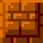

# Bài tập lớn OOP - Bomberman Game

Một phiên bản Java mô phỏng lại trò chơi Bomberman kinh điển của NES.

---

## Contributors

#### - Trần Minh Sáng https://github.com/achibulup
#### - Đỗ Đăng Quyền https://github.com/dodangquyen22
#### - Lâm Trọng Vinh https://github.com/lamtrongvinh

---

- [Video demo](https://youtu.be/_ZtJpHBUFIs)

## Mô tả về trò chơi

### Các đối tượng
Nếu bạn đã từng chơi Bomberman, bạn sẽ cảm thấy quen thuộc với những đối tượng này. Chúng được được chia làm hai loại chính là nhóm đối tượng động (*Bomber*, *Enemy*, *Bomb*) và nhóm đối tượng tĩnh (*Grass*, *Wall*, *Brick*, *Portal*, *Item*).

-  *Bomber* là nhân vật chính của trò chơi. Bomber có thể di chuyển theo 4 hướng trái/phải/lên/xuống theo sự điều khiển của người chơi. 
-  *Bomb* là đối tượng mà Bomber sẽ đặt và kích hoạt tại các ô Grass. Bomber có một lần được đi từ vị trí đặt Bomb ra vị trí bên cạnh. Sau khi kích hoạt 2s, Bomb sẽ tự nổ, các đối tượng *Flame*  được tạo ra.

-  *Grass* là đối tượng mà Bomber và Enemy có thể di chuyển xuyên qua, và cho phép đặt Bomb lên vị trí của nó
-  *Wall* là đối tượng cố định, không thể phá hủy bằng Bomb cũng như không thể đặt Bomb lên được, Bomber và Enemy không thể di chuyển vào đối tượng này
-  *Brick* là đối tượng được đặt lên các ô Grass, không cho phép đặt Bomb lên nhưng có thể bị phá hủy bởi Bomb được đặt gần đó. Bomber và Enemy thông thường không thể di chuyển vào vị trí Brick khi nó chưa bị phá hủy.

-  *Portal* là đối tượng được giấu phía sau một đối tượng Brick. Khi Brick đó bị phá hủy, Portal sẽ hiện ra và nếu tất cả Enemy đã bị tiêu diệt thì người chơi có thể qua Level khác bằng cách di chuyển vào vị trí của Portal.

Các *Item* cũng được giấu phía sau Brick và chỉ hiện ra khi Brick bị phá hủy. Bomber có thể sử dụng Item bằng cách di chuyển vào vị trí của Item.
-  *SpeedItem* tăng vận tốc di chuyển của bomber.
-  *FlameItem* tăng độ dài các Flame khi bomb nổ.
-  *BombItem* giúp tăng số lượng Bomb có thể đặt thêm một.
-  *LifeItem* tăng số mạng của bomber lên một.
-  *TimeItem* tăng thời gian chơi.
-  *StrengthItem* làm cho bomb có thể nổ xuyên tường (và item).
-  *DetonatorItem* giúp cho bomber có khả năng kích hoạt bomb nổ sớm bằng cách bấm phím D.

*Enemy* là các đối tượng mà Bomber phải tiêu diệt hết để có thể qua Level.
-  *Balloom* là Enemy đơn giản nhất, di chuyển ngẫu nhiên với vận tốc cố định.
-  *Oneal* di chuyển "thông minh" hơn, biết tìm đường để đuổi bomber.
-  *Broom* có khả năng đi xuyên qua gạch.
-  *Bear* có tốc độ di chuyển nhanh, có khả năng đuổi theo bomber ở một mức độ nhất định.
-  *Frog* khi chết sẽ tạo ra 2 Balloom tại vị trí của nó.
-  *Fire* di chuyển nhanh, có thể phá hủy item khi chạm vào.

### Mô tả game play, xử lý va chạm và xử lý bom nổ
- Trong một màn chơi, Bomber sẽ được người chơi di chuyển, đặt và kích hoạt Bomb với mục tiêu chính là tiêu diệt tất cả Enemy và tìm ra vị trí Portal để có thể qua màn mới.
- Trò chơi kết thúc khi đồng hồ về số 0 hoặc bomber hết mạng.
- Bomber sẽ bị mất mạng khi va chạm với Enemy hoặc thuộc phạm vi Bomb nổ.
- Enemy bị tiêu diệt khi thuộc phạm vi Bomb nổ
- Một đối tượng thuộc phạm vi Bomb nổ có nghĩa là đối tượng đó va chạm với một trong các tia lửa được tạo ra tại thời điểm một đối tượng Bomb nổ.

- Khi Bomb nổ, một Flame trung tâm tại vị trí Bomb nổ và bốn Flame tại bốn vị trí ô đơn vị xung quanh vị trí của Bomb xuất hiện theo bốn hướng trên/dưới/trái/phải. Độ dài bốn Flame xung quanh mặc định là 1 đơn vị, được tăng lên khi Bomber sử dụng các FlameItem.
- Khi các Flame xuất hiện, nếu có một đối tượng thuộc loại Brick/Wall/Item nằm trên vị trí một trong các Flame thì độ dài Flame đó sẽ được giảm đi để sao cho Flame chỉ xuất hiện đến vị trí đối tượng Brick/Wall/Item theo hướng xuất hiện. Lúc đó chỉ có đối tượng Brick/Wall bị ảnh hưởng bởi Flame, các đối tượng tiếp theo không bị ảnh hưởng.  Flame có thể đi xuyên qua các đối tượng này khi bomber sử dụng StrengthItem. Nếu vật cản Flame là một đối tượng Bomb khác thì đối tượng Bomb đó cũng sẽ nổ ngay lập tức.
